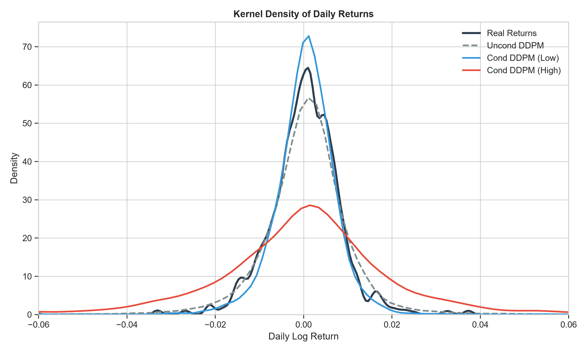
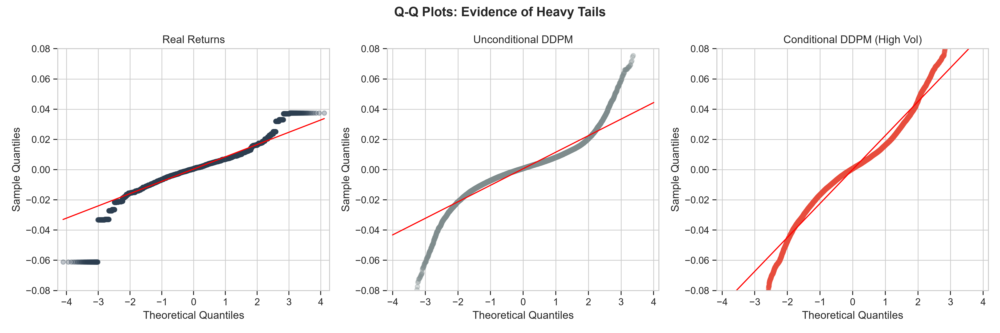
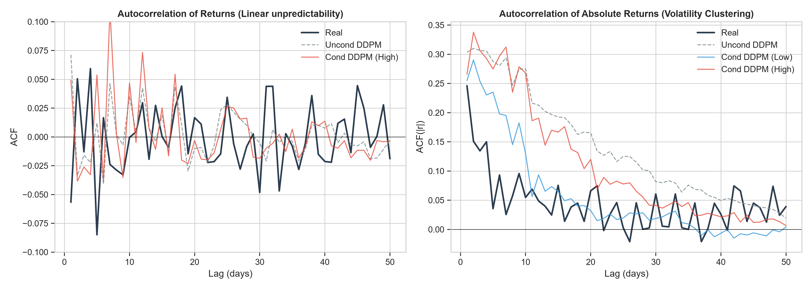
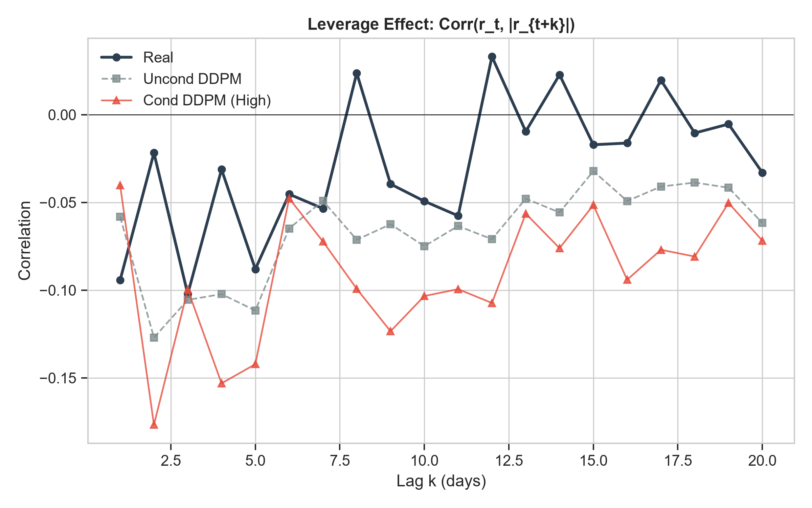
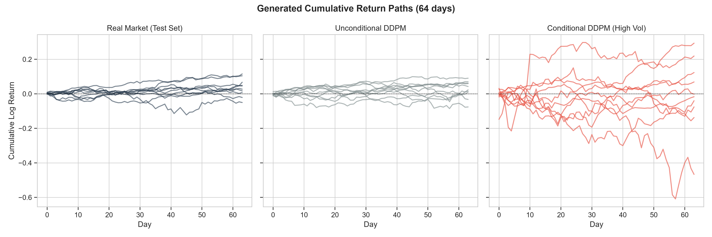

<div align="center">


<br/>

#  NIFTY-DDPM
### *Volatility-Regime-Conditioned Denoising Diffusion Probabilistic Models for Synthetic NIFTY50 Return Generation*

<br/>


<br/>

> *"Can conditioning a DDPM on market volatility regimes produce synthetic Indian equity returns that preserve stylized facts better than an unconditional model?"*

**Co-supervised by:** Prof. Rishikesh Yadav, IIT Mandi

</div>

---

##  Research Question

Standard generative models for financial time series treat all market conditions as a single distribution. In reality, equity markets exhibit **distinct structural regimes** — a calm trending market and a crisis-driven volatile market have fundamentally different return distributions, tail behaviour, and autocorrelation structures.

**This project** trains a Denoising Diffusion Probabilistic Model (DDPM) conditioned on real-time India VIX (volatility index) to answer: *does regime-aware conditioning produce synthetic returns that better preserve the stylized facts of real financial markets?*

---

##  Key Design Choices

| Design Choice | Implementation |
|--------------|---------------|
| **Conditioning signal** | India VIX scalar (continuous) → binary Low/High regime via median split on training data |
| **Conditioning architecture** | FiLM (Feature-wise Linear Modulation) injected in every U-Net ResBlock |
| **Backbone** | 1D U-Net with residual blocks (channels: 64 → 128 → 256) |
| **Noise schedule** | Linear (β: 0.0001 → 0.02, T=1000) |
| **Data split** | Chronological: Train 2009–2022 · Test 2023–2026 (no shuffling — temporal integrity preserved) |
| **Training** | Adam (lr=2e-4), EMA decay=0.999, Early stopping (patience=50), Gradient clipping |
| **Evaluation** | 6 stylized facts + KS test, Ljung-Box, ARCH-LM, Jarque-Bera against real test set |

---

##  Architecture

### Data Pipeline → Model Conditioning

```
NIFTY50 Daily Log-Returns + India VIX (2008–2026)
         │
         ├─► Chronological Train/Test Split (2022 cutoff)
         │
         ├─► Sliding Windows: W=64 trading days, stride=1
         │
         ├─► Regime Labelling: binary_median on TRAIN VIX only
         │       Regime 0: avg_window_VIX < median(train VIX)  → Low Vol
         │       Regime 1: avg_window_VIX ≥ median(train VIX)  → High Vol
         │
         └─► Normalization: z-score on training returns (μ, σ stored to disk)
```

### DDPM + FiLM Conditioning

```
Forward Process (Training):
    q(x_t | x_{t-1}) = N(x_t; √(1-β_t)·x_{t-1}, β_t·I)
    Noise schedule: Linear (β_start=0.0001, β_end=0.02, T=1000)

Denoising Network ε_θ(x_t, t, vix):
    1D U-Net (input: 64-dim return window)
    ├── Time embedding: sinusoidal → MLP, dim=128
    ├── VIX embedding: raw VIX scalar → MLP, dim=128
    └── FiLM in every ResBlock:
            h ← γ(t, vix) ⊙ h + β(t, vix)
            where γ, β are learned from [time_emb ‖ vix_emb]

Reverse Process (Sampling):
    Conditioned on regime label → looks up median VIX for that regime
    Samples 500 windows per regime class
```

---

##  Results — Stylized Facts Evaluation

Four distributions compared:

| Metric | Real Returns | Uncond DDPM | Cond DDPM (Low Vol) | Cond DDPM (High Vol) |
|--------|:---:|:---:|:---:|:---:|
| **Mean (×10⁻⁴)** | 3.75 | 5.79 | 3.94 | 0.46 |
| **Std Dev** | 0.0081 | 0.0109 | 0.0080 | 0.0225 |
| **Skewness** | **−0.47** | +0.23 | −2.68 | −0.12 |
| **Excess Kurtosis** | **5.98** | 32.80 | 48.20 | 10.40 |
| **Tail Index (Hill)** | **2.86** | 2.56 | 2.59 | **2.78** |
| **ACF \|r\| lag-1** | **0.246** | 0.304 | 0.255 | 0.266 |
| **Leverage Corr lag-1** | **−0.094** | −0.058 | −0.079 | −0.040 |
| **KS Stat (vs Real)** | 0.000 | 0.047 | 0.041 | 0.188 |

> Key finding: **Cond DDPM (Low Vol)** achieves the lowest KS distance (0.041) to real returns and best matches mean/std. **Cond DDPM (High Vol)** correctly produces higher variance (σ=0.023 vs σ=0.008 in calm regimes) — demonstrating effective regime separation. Full results in `data/processed/table1_stylized_facts.csv`.

---

##  Sample Outputs

**Return Distributions (KDE):**



**Q-Q Plots (Fat Tails Evidence):**



**Volatility Clustering (ACF of |returns|):**



**Leverage Effect:**



**Sample Cumulative Return Paths:**



---

##  Repository Structure

```
nifty-ddpm/
│
├── configs/
│   └── config.yaml                   ← All hyperparameters in one place
│
├── data/
│   ├── raw/                          ← Downloaded CSVs (auto-generated, git-ignored)
│   ├── processed/                    ← Cleaned data, norm params, Table 1 CSV
│   └── windows/                      ← PyTorch window tensors (git-ignored)
│
├── notebooks/
│   ├── 01_data_engineering.ipynb     ← Download, clean, window, label, save
│   ├── 02_eda.ipynb                  ← Stylized facts of real NIFTY50 returns
│   ├── 03_unconditional_ddpm.ipynb   ← Baseline DDPM (no conditioning)
│   ├── 04_conditional_ddpm.ipynb     ← VIX-conditioned DDPM + EMA training
│   └── 05_evaluation.ipynb           ← Stylized facts comparison + statistical tests
│
├── outputs/
│   ├── checkpoints/                  ← Trained model weights (git-ignored, ~18MB each)
│   ├── samples/                      ← Generated .pt tensors per regime
│   └── figures/                      ← All publication-ready plots (PNG + PDF)
│
├── generate_nb05.py                  ← Script to regenerate Notebook 05 programmatically
├── run_nb05.py                       ← Script to execute Notebook 05 via nbconvert
└── requirements.txt
```

---

##  Quick Start

```bash
git clone https://github.com/arpitdhaka05/nifty-regime-ddpm
cd nifty-regime-ddpm

pip install -r requirements.txt
```

### Run notebooks in order:

```
01_data_engineering  →  02_eda  →  03_unconditional_ddpm  →  04_conditional_ddpm  →  05_evaluation
```

Each notebook is **self-contained** — it loads its inputs from disk and saves all outputs (models, samples, figures) to `outputs/` for the next notebook.

> **Google Colab:** Just run the first cell in each notebook — it installs missing packages automatically.

### All hyperparameters are centralised in `configs/config.yaml`:

```yaml
data:
  window_size: 64        # Sliding window in trading days
  regime_method: "binary_median"

model:
  channels: [64, 128, 256]
  embed_dim: 128

diffusion:
  num_timesteps: 1000
  beta_start: 0.0001
  beta_end: 0.02
```

---

##  References

1. Ho et al. (2020) — "Denoising Diffusion Probabilistic Models" — arXiv:2006.11239
2. Cont (2001) — "Empirical properties of asset returns: stylized facts and statistical issues" — Quantitative Finance
3. Buehler et al. (2019) — "Deep Hedging" — Quantitative Finance
4. CoFinDiff — Conditioning architecture inspiration
5. Perez et al. (2018) — "FiLM: Visual Reasoning with a General Conditioning Layer"

---

<div align="center">

**Active Research** · NIT Goa × IIT Mandi  
Arpit Dhaka · Prof. Rishikesh Yadav

</div>
